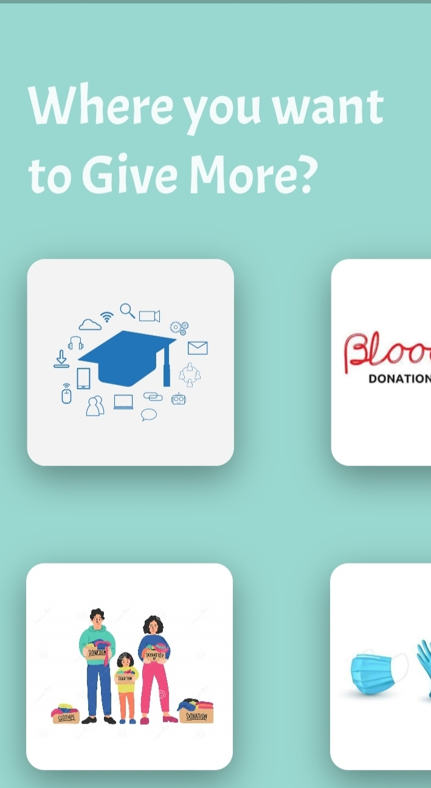
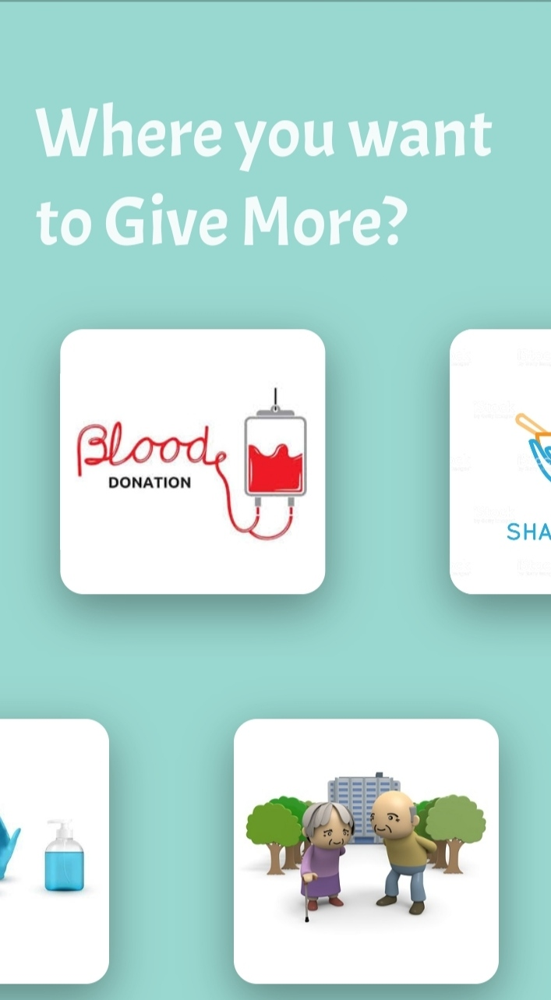
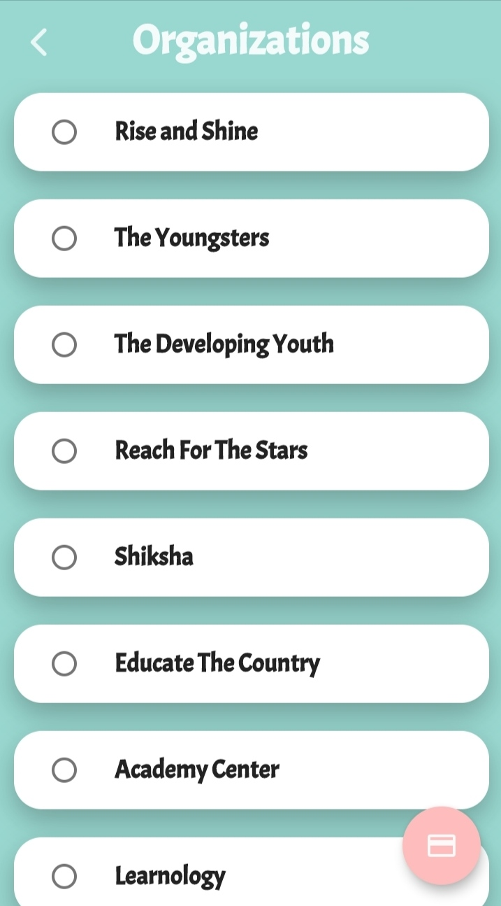
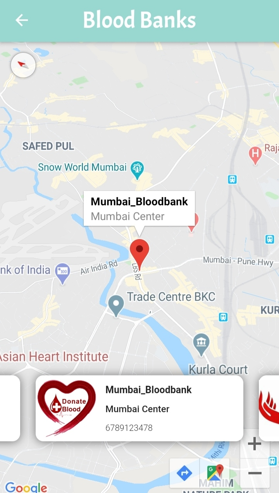

<h1 align="center">
  GIVE MORE
</h1>
&nbsp;
&nbsp;

  ★ Developed Android Application Using Flutter
   
   ★ which can use for to Give donation with net banking and cards etc.
    
 ★ User can see location of donation centers in map and App is implemented For Donating 6 Various needs like Education,food etc.

<table>
  <tr>
    <td></td>
    <td></td> 
    <td></td>
  </tr>
  </table>

<table>
  <tr>
    <td></td>
    <td>></td>
    
  </tr>
  </table>
